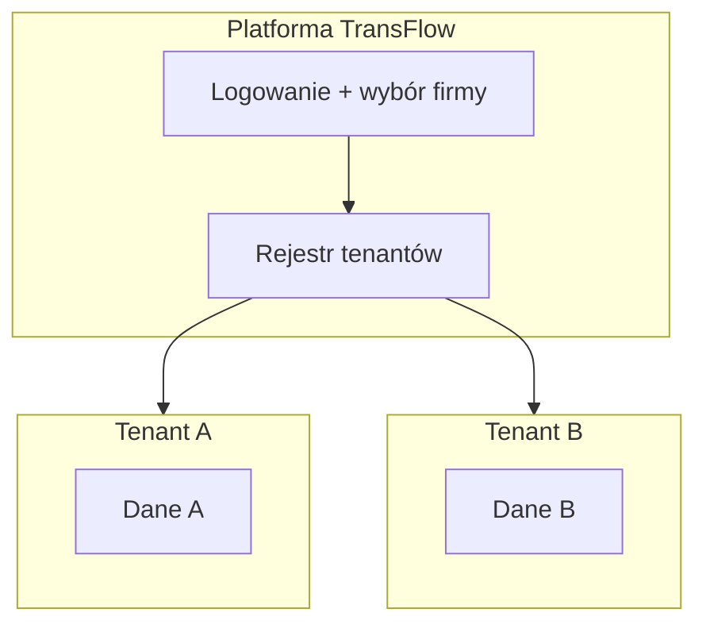

# TransFlow — architektura

> **Wersja:** 0.1.0 · **Ostatnia aktualizacja:** 2026-05-30

## 1. Wizja produktu

SaaS dla firm TSL (małe/średnie). Właściciel sprzedaje **abonament** — każdy klient to **tenant** z własnymi danymi, użytkownikami i włączonymi modułami.

Faza obecna: **v0.4** — localStorage + sync Supabase (osobny projekt) + deploy Vercel.

> **Supabase:** NOWY projekt (nie wgdom). Setup → `SUPABASE-SETUP.md`, sync → `docs/SUPABASE-ARCHITECTURE.md`

---

## 2. Multi-tenant SaaS



### Tenant (encja)

| Pole | Opis |
|------|------|
| `id` | UUID tenant |
| `slug` | Kod logowania, np. `DEMO-TRANS` |
| `name` | Nazwa firmy |
| `plan` | `trial` / `starter` / `business` / `enterprise` |
| `status` | `active` / `suspended` / `trial_expired` |
| `settings.modules` | Moduły wg abonamentu |

### Izolacja danych (dev)

```
localStorage:
  ft-tenants-registry     → lista firm
  ft-{tenantId}-drivers   → kierowcy firmy
  ft-{tenantId}-vehicles  → flota
  ft-{tenantId}-courses   → kursy
  ...
```

### Produkcja (v0.4+)

- **Osobny** projekt Supabase (tabela `kv_store_transflow`, Edge `transflow-api`)
- Frontend na **Vercel** (`vercel.json`)
- Sync offline-first: `src/lib/cloud-sync.ts`
- Docelowo: Auth Supabase + RLS na tabelach relacyjnych

---

## 3. Role użytkowników

| Rola | Uprawnienia |
|------|-------------|
| `owner` | Wszystko + ustawienia firmy, koszty, moduły |
| `dispatcher` | Operacje: kursy, flota, kierowcy (bez ustawień billing) |
| `driver` | Własne kursy, raport dzienny, profil |

Docelowo: `platform_admin` (Ty jako sprzedawca SaaS) — osobny panel.

---

## 4. Moduły abonamentu

| Moduł | Klucz | Opis |
|-------|-------|------|
| Flota | `fleet` | Pojazdy, serwisy, dokumenty |
| Kierowcy | `drivers` | Kartoteka, uprawnienia |
| Kursy | `courses` | Zlecenia transportowe |
| Zgodność | `compliance` | ADR, tachograf, alerty |
| GPS | `gps` | Mapa, ETA |
| Giełda ładunków | `loadBoard` | Szukanie kursów |
| Tachograf | `tachographImport` | Import DDD |

UI filtruje nawigację przez `settings.modules`.

---

## 5. Domena transportu (słownik)

| Pojęcie | Opis |
|---------|------|
| **Kurs / zlecenie** | Trasa A→B, ładunek, fracht, terminy |
| **CMR** | List przewozowy |
| **ADR** | Transport materiałów niebezpiecznych |
| **561/2006** | Rozporządzenie UE — czasy jazdy i odpoczynku |
| **Kod 95 / CPC** | Kwalifikacja kierowcy zawodowego |
| **Raport dzienny** | km, paliwo, opłaty, postoje od kierowcy |

Szczegóły przepisów → osobny doc `docs/DOMAIN-TRANSPORT.md` (Faza 2).

---

## 6. Stack techniczny

| Warstwa | Tech |
|---------|------|
| UI | React 19, TypeScript, Vite 8 |
| Style | Tailwind 4 |
| Ikony | lucide-react |
| Dane (prod) | Supabase KV + Edge `transflow-api` |
| Hosting | **Vercel** |

---

## 7. Layout aplikacji

```
LoginScreen (kod firmy + rola)
    │
    ├─ owner / dispatcher → AdminShell (sidebar + bottom nav mobile)
    └─ driver → DriverShell (bottom nav, mobile-first)
```

Pliki: `src/app/shells/`, `src/app/views/`, `src/lib/navigation.ts`

---

## 8. Roadmap

### v0.1 ✅ (obecna)
- Szkielet, multi-tenant, layout, role, moduły placeholder

### v0.2
- Encje + CRUD: kursy, kierowcy, pojazdy
- Raport dzienny kierowcy

### v0.3
- Supabase, auth email, sync
- Compliance alerty

### v0.4
- GPS, giełda ładunków, tachograf

---

## 9. Kiedy potrzebny Supabase?

| Etap | localStorage wystarczy | Supabase potrzebny |
|------|------------------------|-------------------|
| **Teraz (v0.1–0.3)** | ✅ Ty sam, jedna przeglądarka, prototyp UI | ❌ Nie |
| **Test u Ciebie** | ✅ Kilka modułów, demo dane, jeden komputer | ❌ Opcjonalnie |
| **Test u firmy (pilot)** | ⚠️ Ograniczone — dane tylko w jednej przeglądarce | ✅ **Tak** — wspólna baza, login hasłem |
| **Wiele urządzeń** | ❌ Brak syncu telefon ↔ biuro | ✅ **Tak** |
| **Produkcja / abonament** | ❌ | ✅ **Tak** — auth, RLS, backup, Edge Functions |

**Praktycznie:** daj mi dostęp do Supabase, gdy będziesz chciał:
1. Udostępnić aplikację **innej firmie** (kierowca na telefonie + biuro na PC),
2. **Nie stracić danych** po wyczyszczeniu przeglądarki,
3. Wdrożyć **prawdziwe logowanie** (email/hasło per użytkownik),
4. Wystawić aplikację na **domenę** (Vercel + Supabase jak wgdom).

Do tego momentu pracujemy lokalnie — **zero kosztów, zero konfiguracji chmury**.
