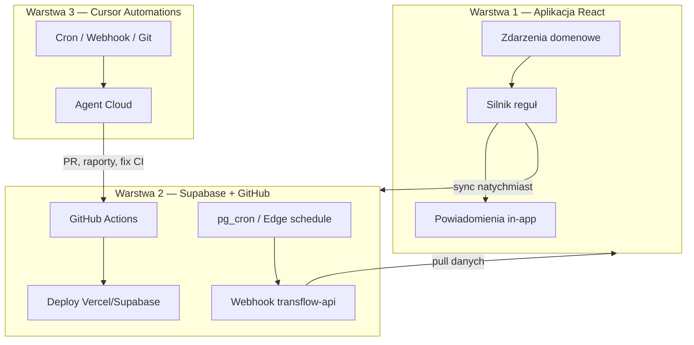

# TransFlow — automatyzacja (architektura)

> **Cel:** Wszystko co da się zautomatyzować — robi się samo. Reszta → alert dla człowieka.

---

## 3 warstwy automatyzacji



| Warstwa | Co automatyzuje | Kiedy |
|---------|-----------------|-------|
| **1. In-app** | Alerty 561/2006, brak CMR, compliance, zapis CSV do biblioteki, sync push | Natychmiast po zdarzeniu |
| **2. Backend** | Cotygodniowy backup KV, przypomnienia email (v0.8+), webhooki z zewnątrz | Cron / webhook |
| **3. Cursor** | Review PR, deploy fix, generowanie docs po merge | Harmonogram / Git event |

---

## Zdarzenia domenowe (Warstwa 1)

| Zdarzenie | Przykład | Możliwe akcje auto |
|-----------|----------|-------------------|
| `daily_report.saved` | Kierowca zapisuje raport | Alert czasu jazdy, sync natychmiast |
| `daily_report.shift_ended` | „Kończę pracę” | Powiadomienie dyspozytora |
| `course.saved` | Nowy kurs międzynarodowy | Flag brak CMR / RMPD |
| `compliance.check` | Codziennie przy starcie | Powiadomienie wygasających docs |
| `schedule.weekly` | Poniedziałek rano | Eksport CSV → biblioteka Pliki |
| `sync.completed` | Pull/push OK | — |

Reguły per tenant: `ft-{tenantId}-automation` (włącz/wyłącz w **Automatyzacje**).

---

## Co jest już zautomatyzowane (v0.7)

- Push do Supabase (debounce 2 s) → opcjonalnie **natychmiast** przy krytycznych zdarzeniach
- Pull przy starcie aplikacji (`CloudLoader`)
- Deploy produkcji przy push na `main` (GitHub Actions → Vercel + Supabase)
- Silnik reguł + powiadomienia in-app (`src/lib/automation/`)
- Cotygodniowy eksport raportów do biblioteki (reguła `schedule.weekly`)

---

## Warstwa 2 — Supabase (plan)

1. **Webhook** `POST /transflow-api/automation/webhook` — zewnętrzne systemy (np. giełda ładunków) mogą triggerować sync.
2. **pg_cron** (v0.8) — codzienne sprawdzenie compliance w chmurze, email do właściciela.
3. **Supabase Auth** — po v0.7 reguły powiązane z użytkownikiem, nie tylko tenant.

---

## Warstwa 3 — Cursor Automations (propozycje)

Gotowe szablony do utworzenia w Cursor → Automations:

| Nazwa | Trigger | Działanie |
|-------|---------|-----------|
| **TransFlow — deploy po merge** | PR merged na `main` | Sprawdź Vercel/Actions, napraw jeśli fail |
| **TransFlow — weekly ops** | Cron: poniedziałek 7:00 | Przegląd repo, aktualizacja ROADMAP/CURRENT-TASK |
| **TransFlow — webhook backup** | HTTP webhook | Agent generuje raport stanu projektu |

Webhook URL dostaniesz po zapisaniu automatyzacji w Cursor.

---

## Czego NIE da się zautomatyzować w przeglądarce

- Rejestracja **RMPD/SENT** w PUESC (wymaga certyfikatu / logowania gov)
- Import **tachografu DDD** bez pliku od kierowcy
- **Email/SMS** bez backendu (Resend, Twilio — v0.8)
- **GPS na żywo** bez PWA + uprawnień telefonu

Te kroki → alert + link / instrukcja w UI.

---

## Pliki kodu

```
src/lib/automation/
  events.ts      — typy zdarzeń
  rules.ts       — domyślne reguły + ustawienia tenant
  engine.ts      — dopasowanie reguł + wykonanie
  actions.ts     — konkretne akcje (notify, export, sync)
  notifications-store.ts
  scheduler.ts   — harmonogram daily/weekly w app
src/app/views/AutomationsView.tsx
src/app/components/AutomationNotifications.tsx
```
