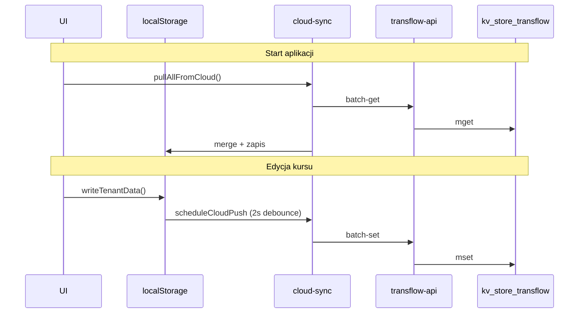

# TransFlow — Supabase i sync (dla AI)

> **Ostatnia aktualizacja:** 2026-05-30 · v0.4.0

## Zasada #1: osobny projekt

| | wgdom | TransFlow |
|---|-------|-----------|
| Supabase project | `kchwyjlnkdlymwvsnfiu` (NIE UŻYWAĆ) | **Nowy projekt** użytkownika |
| Tabela KV | `kv_store_0afb8820` | `kv_store_transflow` |
| Edge Function | `make-server-0afb8820` | `transflow-api` |
| Env slug | `VITE_SUPABASE_FUNCTION_SLUG=make-server-0afb8820` | `transflow-api` |

---

## Pliki sync (kolejność czytania)

1. `src/config/supabase.ts` — env, `isSupabaseConfigured()`
2. `src/lib/cloud-sync.ts` — pull/push, merge, status
3. `src/lib/tenant/storage.ts` — localStorage + `scheduleCloudPush`
4. `src/app/CloudLoader.tsx` — pull przy starcie
5. `supabase/functions/transflow-api/index.ts` — API

---

## Klucze w chmurze (identyczne jak localStorage)

```
ft-tenants-registry
ft-{tenantId}-drivers
ft-{tenantId}-vehicles
ft-{tenantId}-courses
ft-{tenantId}-daily-reports
ft-{tenantId}-compliance-alerts
ft-{tenantId}-settings
```

Helper: `tenantStorageKey(tenantId, key)` w `src/lib/tenant/types.ts`

---

## API Edge Function

Base: `https://{PROJECT_ID}.supabase.co/functions/v1/transflow-api`

| Endpoint | Body | Response |
|----------|------|----------|
| `GET /transflow-api/health` | — | `{ status: "ok" }` |
| `POST /transflow-api/batch-get` | `{ keys: string[] }` | `{ values: unknown[] }` |
| `POST /transflow-api/batch-set` | `{ entries: [{ key, value }] }` | `{ ok: true }` |

Auth header: `Authorization: Bearer {VITE_SUPABASE_ANON_KEY}`

---

## Flow sync



### Merge tablic (drivers, vehicles, courses)

Union po `id` — cloud + local, cloud nadpisuje ten sam id.

---

## Bez Supabase

Gdy brak `.env` → `isSupabaseConfigured() === false` → tylko localStorage, badge „local” w headerze.

---

## Deploy

- **Frontend:** Vercel + `VITE_*` env
- **Backend:** GitHub Secret `SUPABASE_ACCESS_TOKEN` + `SUPABASE_PROJECT_REF`
- **SQL:** ręcznie w SQL Editor lub `supabase db push`

Pełna instrukcja: `SUPABASE-SETUP.md`

---

## Nie robić

- Nie importować kodu z repo wgdom 1:1 (inna domena)
- Nie używać `kv_store_0afb8820` ani starego project ref
- Nie commitować `.env` z kluczami
