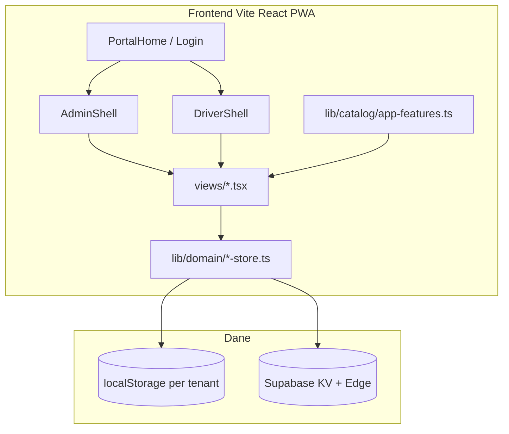

# TransFlow / Tajski-Trans — przegląd systemu dla agentów AI i developerów

> **Wersja aplikacji:** 0.17.3 · **Katalog funkcji:** `src/lib/catalog/app-features.ts`  
> **Autor systemu:** Dawid Thai Thanh · **Produkcja:** https://firmatransportowa.vercel.app

Ten dokument pozwala **wejść w repo i od razu wiedzieć**, czym jest system, jak jest zbudowany i gdzie szukać kodu — bez czytania wszystkich plików.

---

## 1. Czym jest ten system?

**SaaS multi-tenant** do zarządzania **polską firmą transportową (TSL)**:

| Rola | Co robi w systemie |
|------|-------------------|
| **Właściciel** | Pełny panel: flota, kursy, giełda ładunków, zgodność, rozliczenia, ustawienia, integracje |
| **Dyspozytor** | Operacje: kursy, giełda, raporty, flota, kierowcy, awarie (bez rozliczeń / ustawień firmy) |
| **Kierowca** | Mobile PWA: raport dzienny, kursy, awaria, ITD, profil |
| **Mechanik** | Lista zleceń napraw z modułu awarii |

**Wdrożenie firmowe:** `VITE_DEPLOYMENT_MODE=company` → branding **Tajski-Trans** (`src/config/branding.ts`).

---

## 2. START HERE — kolejność czytania

```text
1. docs/SYSTEM-OVERVIEW.md     ← TEN PLIK (mapa systemu)
2. src/lib/catalog/app-features.ts   ← REJESTR FUNKCJI (aktualizuj przy każdej zmianie)
3. AGENTS.md                   ← zasady pracy, komendy
4. docs/ARCHITECTURE.md        ← multi-tenant, moduły, stack
5. docs/SUPABASE-ARCHITECTURE.md   ← sync, Edge API
6. docs/DOMAIN-TRANSPORT.md    ← słownik TSL (kurs, CMR, ADR…)
7. CURRENT-TASK.md             ← ostatni stan prac
```

---

## 3. Architektura warstw



| Warstwa | Ścieżka | Odpowiedzialność |
|---------|---------|------------------|
| Routing / role | `src/app/App.tsx` | Wybór shell + widok wg sesji |
| Nawigacja | `src/lib/navigation.ts` | `AdminView`, menu owner/dispatcher/driver |
| Widoki UI | `src/app/views/` | Ekrany biznesowe |
| Logika domeny | `src/lib/domain/` | CRUD, reguły, store tenant-scoped |
| Tenant | `src/lib/tenant/` | Typy, context, `readTenantData` / `writeTenantData` |
| Sync chmura | `src/lib/cloud-sync.ts` | Push/pull Supabase, merge |
| Katalog funkcji | `src/lib/catalog/app-features.ts` | **Single source of truth** funkcji produktu |
| Pomoc UI | `src/lib/help/panel-help.ts` | Instrukcje per widok |
| Edge API | `supabase/functions/transflow-api/` | KV, auth, sync tachografu/telematyki |

---

## 4. Multi-tenant — jak izolowane są dane

- **Tenant** = firma klienta (`Tenant` w `src/lib/tenant/types.ts`)
- **Klucz storage:** `ft-{tenantId}-{dataKey}` w localStorage
- **Data keys:** `drivers`, `vehicles`, `courses`, `freight-offers`, `settings`, … — pełna lista w `TenantDataKey`
- **Moduły abonamentu:** `TenantModules` — UI filtruje nawigację (`module` w `NavItem`)

Nowy typ danych → dodaj do `TenantDataKey`, store w `lib/domain/`, merge w `lib/sync/merge-strategy.ts`.

---

## 5. Shells i nawigacja

| Shell | Plik | Nawigacja |
|-------|------|-----------|
| Admin | `src/app/shells/AdminShell.tsx` | Sidebar (desktop) + dolna belka + menu wysuwane (mobile) |
| Kierowca | `src/app/shells/DriverShell.tsx` | Dolna belka zawsze widoczna |
| Mechanik | `src/app/shells/MechanicShell.tsx` | Jedna zakładka |

Menu admin mobile: `src/app/components/AdminMobileNav.tsx`

---

## 6. Mapa widoków → pliki

| Widok admin (`AdminView`) | Plik | Kluczowe dane |
|---------------------------|------|---------------|
| `dashboard` | `DashboardView.tsx` | agregaty, alerty |
| `features` | `FeaturesView.tsx` | katalog z `app-features.ts` |
| `courses` | `CoursesView.tsx` | `courses` |
| `loads` | `FreightBoardView.tsx` | `freight-offers`, `freight-connectors` |
| `reports` | `DailyReportsView.tsx` | `daily-reports` |
| `settlements` | `SettlementsView.tsx` | kursy + raporty |
| `files` | `FilesView.tsx` | `files` |
| `automations` | `AutomationsView.tsx` | `automation` |
| `fleet` | `FleetView.tsx` | `vehicles`, `fleet-positions` |
| `repairs` | `RepairsView.tsx` | `repair-reports` |
| `itd` | `ItdAdminView.tsx` | `itd` |
| `drivers` | `DriversView.tsx` | `drivers` |
| `compliance` | `ComplianceView.tsx` | `settings`, alerty |
| `tachograph` | `TachographView.tsx` | `tachograph`, `tachograph-connectors` |
| `settings` | `SettingsView.tsx` | `settings`, connectory |

| Panel kierowcy | Plik |
|----------------|------|
| Start, raport, profil | `DriverViews.tsx` |
| Awaria | `DriverIssueView.tsx` |
| ITD | `DriverItdView.tsx` |

---

## 7. Integracje zewnętrzne (Edge / demo)

| Integracja | Frontend | Edge |
|------------|----------|------|
| Giełdy frachtu (8 platform) | `lib/domain/freight-connectors.ts` | prod: klucze API w Edge |
| Telematyka Webfleet/Transics | `fleet-telematics-connectors.ts` | `fleet_telematics_sync.ts` |
| Tachograf API | `tachograph-connectors.ts` | `tachograph_sync.ts` |
| Sync KV | `cloud-sync.ts` | `transflow-api/index.ts` |

Status **beta** = demo generuje syntetyczne dane; produkcja wymaga credentials w Supabase.

---

## 8. Jak dodać nową funkcję (checklist)

1. **`src/lib/catalog/app-features.ts`** — wpis z opisem, rolą, `codePaths`, `dataKeys`
2. Jeśli **nowy widok** → `navigation.ts` (`AdminView` + `OWNER_NAV`) → `App.tsx` → `panel-help.ts`
3. Jeśli **nowe dane** → `TenantDataKey` + store + `merge-strategy.ts`
4. Jeśli **integracja API** → connector w `lib/domain/` + route w Edge
5. **`npm run build`** — TypeScript + walidacja help registry w DEV
6. Opcjonalnie: `docs/SYSTEM-OVERVIEW.md` sekcja 6–7 jeśli zmiana architektury

**Usuwanie funkcji:** usuń wpis z katalogu, widok z nawigacji i powiązany kod — katalog musi odzwierciedlać stan produktu.

---

## 9. Komendy i deploy

```bash
npm run dev      # localhost:5174
npm run build
npm run supabase:deploy   # Edge transflow-api
```

- **Frontend:** Vercel (`firmatransportowa.vercel.app`)
- **Backend:** Supabase projekt `roiainuiyqenfpkqixpv` (osobny od innych projektów)
- **Wersja:** `package.json` → `src/config/version.ts`

---

## 10. Demo / test

- Kod firmy: `DEMO-TRANS` (multi-tenant) lub tryb company Tajski-Trans
- Hasło demo: `demo2026`
- Otwarty dostęp testowy: `src/config/test-access.ts`

---

## 11. Powiązane pliki

| Plik | Cel |
|------|-----|
| `AGENTS.md` | Reguły dla agentów |
| `PROJECT-GUIDE.md` | Krótki przewodnik produktu |
| `docs/AUTOMATION.md` | Automatyzacje |
| `docs/ROADMAP.md` | Plany rozwoju |
| `DEPLOY.md` | Wdrożenie Vercel |

**Pełna lista funkcji z opisami dla użytkownika:** panel admina → zakładka **Funkcje** lub export z `APP_FEATURES` w kodzie.
